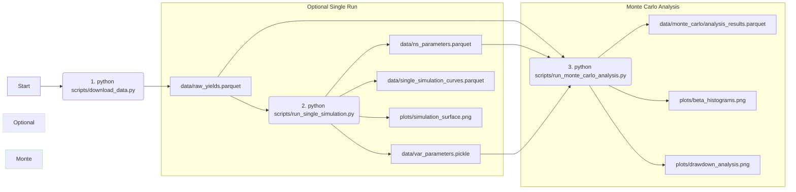

# US Treasury Yield Curve Simulation and Analysis

This project provides tools to download historical US Treasury yield curve data, fit the Nelson-Siegel model, simulate future yield curve evolution using a VAR model, and perform Monte Carlo analysis on the simulations, including portfolio drawdown calculations.

## Project Structure

```
irrf/
├── data/                 # Stores intermediate and final data (Parquet, Pickle)
│   ├── raw_yields.parquet
│   ├── ns_parameters.parquet
│   ├── var_parameters.pickle
│   ├── single_simulation_curves.parquet
│   └── monte_carlo/
│       ├── simulation_paths.parquet # (Optional, large - currently saves as .npy)
│       └── analysis_results.parquet
├── plots/                # Stores generated plots (PNG)
│   ├── simulation_surface.png
│   ├── beta_histograms.png
│   └── drawdown_analysis.png
├── scripts/              # Executable Python scripts for workflow stages
│   ├── download_data.py
│   ├── run_single_simulation.py
│   └── run_monte_carlo_analysis.py
├── src/                  # Source code modules
│   ├── __init__.py
│   ├── config.py         # Configuration and constants
│   ├── data_loader.py    # Data downloading, loading, saving
│   ├── nelson_siegel.py  # Nelson-Siegel model fitting
│   ├── var_simulation.py # VAR model fitting and simulation
│   ├── portfolio.py      # Portfolio definition and analysis
│   └── plotting.py       # Plotting functions
├── notebooks/            # (Optional) Jupyter notebooks for exploration
├── irrf.py               # Original monolithic script (kept for reference, not used by new structure)
├── PLAN.md               # Detailed project plan
└── requirements.txt      # Python dependencies
```

## Setup

1.  **Clone the repository (if applicable).**
2.  **Create a virtual environment (recommended):**
    ```bash
    python -m venv venv
    # Activate the environment
    # Windows (PowerShell/CMD):
    .\venv\Scripts\activate
    # macOS/Linux (Bash/Zsh):
    source venv/bin/activate
    ```
3.  **Install dependencies:**
    ```bash
    pip install -r requirements.txt
    ```

## Usage

Run the scripts from the project's root directory (`irrf/`).

## Workflow Diagram

This diagram shows the typical workflow and dependencies between the scripts:




1.  **Download Historical Data:**
    *   Fetches the latest available full year of daily Treasury yield curve data from the US Treasury website.
    *   Processes and saves the data to `data/raw_yields.parquet`.
    ```bash
    python scripts/download_data.py
    ```

2.  **Run a Single Deterministic Simulation:**
    *   Loads the raw data.
    *   Fits the Nelson-Siegel model to the historical data and saves parameters (`data/ns_parameters.parquet`).
    *   Fits a VAR(1) model to the NS factors and saves the results (`data/var_parameters.pickle`).
    *   Generates a single, deterministic forecast path for the yield curve based on the VAR model.
    *   Saves the simulated curve path (`data/single_simulation_curves.parquet`).
    *   Generates a 3D surface plot of the simulation (`plots/simulation_surface.png`).
    ```bash
    python scripts/run_single_simulation.py
    ```
    *Note: This script will overwrite previously saved NS/VAR parameters if run again.*

3.  **Run Monte Carlo Analysis:**
    *   Loads raw data and attempts to load pre-computed NS/VAR parameters. If not found, it fits them (like `run_single_simulation.py`).
    *   Runs a specified number of stochastic simulations (`MC_RUNS` in `src/config.py`, default 1000) using the fitted VAR model.
    *   Generates yield curves for all simulations.
    *   Defines a hypothetical portfolio (see `src/config.py` and `src/portfolio.py`).
    *   Calculates the value and drawdown for the portfolio over time for each simulation path.
    *   Collects analysis results (max drawdown per simulation, final NS beta factors).
    *   Saves the analysis results (`data/monte_carlo/analysis_results.parquet`).
    *   Generates histograms of the final beta factors (`plots/beta_histograms.png`).
    *   Generates a histogram of the maximum portfolio drawdowns (`plots/drawdown_analysis.png`).
    ```bash
    python scripts/run_monte_carlo_analysis.py
    ```

## Outputs

*   **Data:** Intermediate and final data files are saved in the `data/` directory, primarily in Parquet format. VAR model results are saved as a Pickle file.
*   **Plots:** Generated plots are saved as PNG images in the `plots/` directory.

## Configuration

Key parameters (data URL, simulation years, number of MC runs, file paths, portfolio definition) can be adjusted in `src/config.py`.